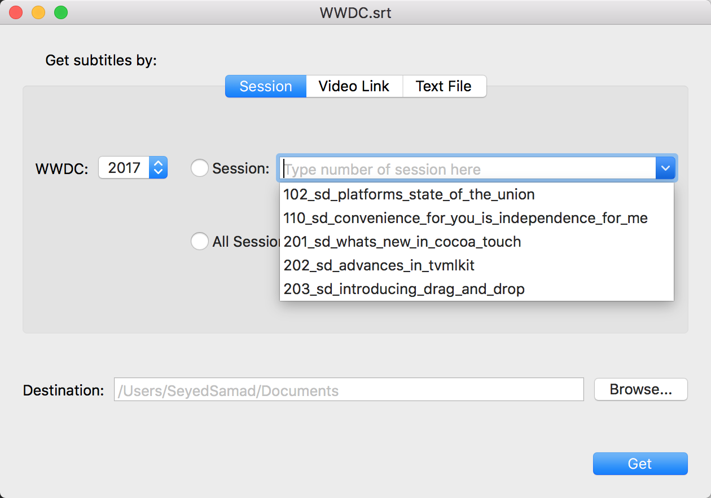

  

    
    
    
    </a>
    

# WWDC.srt
###An app for Download WWDC subtitles

WWDC.srt allows you to download subtitle for each WWDC session video since 2013 in (**srt**) format.

⬇️ If you just want to download the latest release, go to [this link](./Releases/WWDC.srt.app).

## Session

In this tab you can choose ( or search session number of ) your favorite WWDC Session video from the list and download it's subtitle by clicking get button. Also you can download all sessions subtitle alltogether by choosing (All Sessions) radio button.

## Video Link

In this tab you can paste WWDC video link like:
 ` https://devstreaming-cdn.apple.com/videos/wwdc/2017/102xyar2647hak3e/102/102_hd_platforms_state_of_the_union.mp4?dl=1
 `
  and download it's subtitle.
  
  

## Text File

In this tab you can just drag a text file which contains a bunch of your favorite WWDC Videos link into the view and download their subtitles altogether.

  

## Building the app

**Building requires Xcode 9 or later.**

Just clone this branch and run the project in xcode 9.