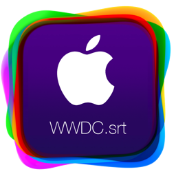
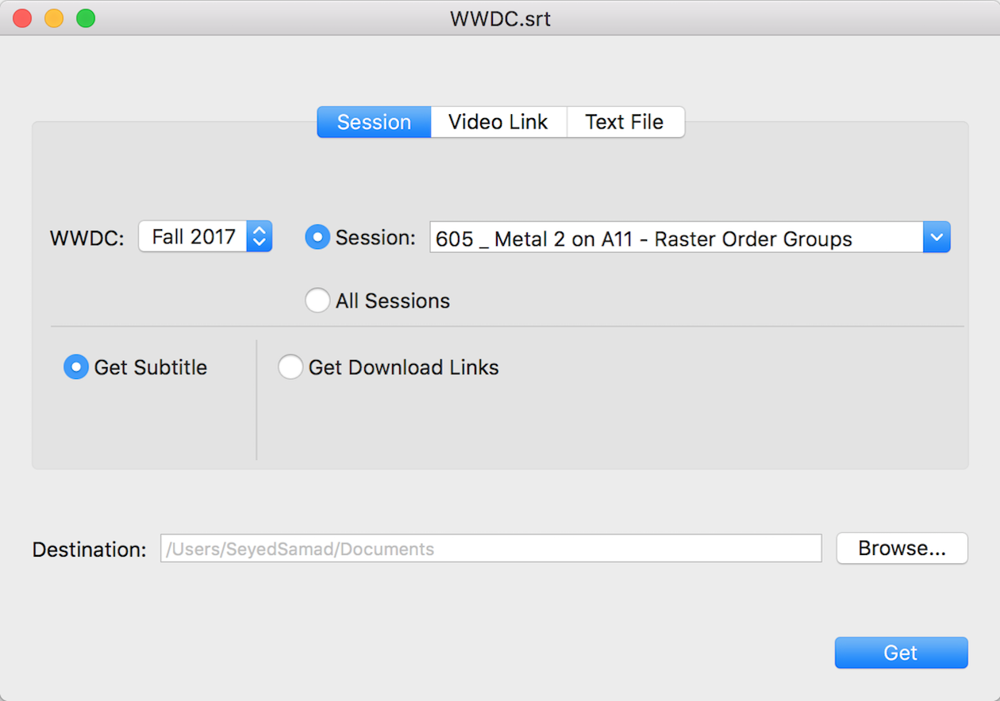
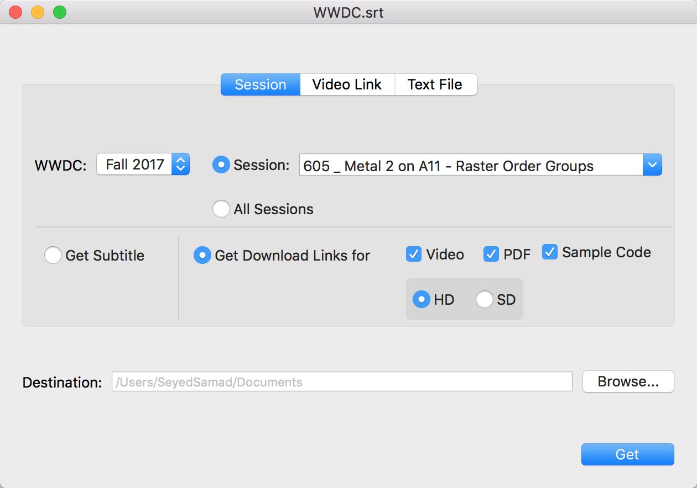
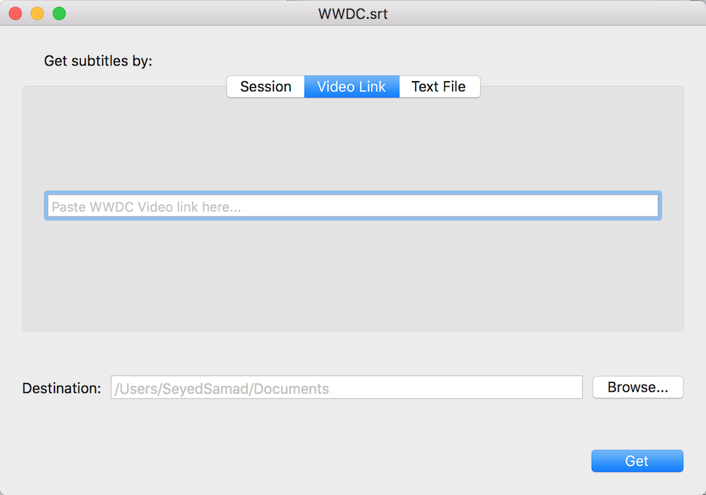
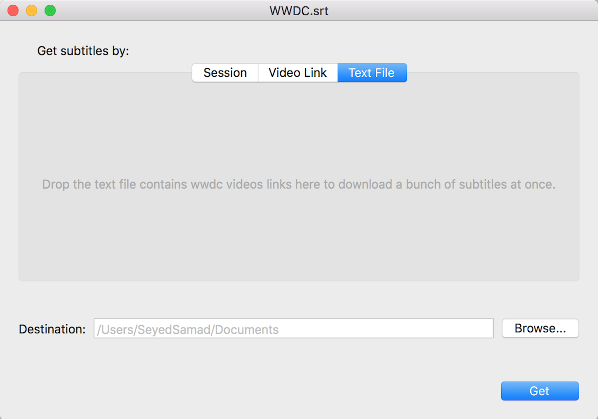

  

    
    
    
    
    </a>
    

# WWDC.srt
#### An app for Download WWDC subtitles

### Whats New: 

**version 1.6.3:**

- Supports WWDC 2020

**version 1.6.2:**

- Now can download link of Sample codes for WWDC 2019, 2018, 2017, 2016 videos
- Some minor bugs fixed

**version 1.6.1:**

- WWDC 2019 Added.

**version 1.6.0:**

- Performance optimized. Now you get links and subtitles much faster.
- Now supports Tech Talks Video's links

**version 1.5.3:**

- Fixed  an issue that failed to get all links after you selecting a special link to get

**version 1.5.2:**

- Fixed  an issue that downloads wrong subtitle for selected session in some cases

**version 1.5.1:**

- Now supports WWDC 2018 video's links

	
- Now you can get links of videos, pdfs and sample codes for each session you want and even for all sessions at once!

- Now the app opens the destination address of your desired data in finder, after downloading them.

- Some minor bugs fixed

**version 1.0.1:**
	
- Now supports Fall 2017 video's links

## Intro
WWDC.srt allows you to download subtitle for each WWDC session video since 2013 in (**srt**) format.

⬇️ If you just want to download the latest release, go to [this link](./Releases/WWDC.srt.zip).

## Session

In this tab you can choose ( or search session number of ) your favorite WWDC Session video from the list and download it's subtitle or data links by clicking get button. Also you can download all sessions subtitles or data links alltogether by choosing (All Sessions) radio button.
Data links are include videos links (HD or SD depending on your choice), pdf links and sample code links.

## Video Link

In this tab you can paste WWDC video link like:

 ` https://devstreaming-cdn.apple.com/videos/tutorials/20170912/201qy4t11tjpm/building_apps_for_iphone_x/building_apps_for_iphone_x_hd.mp4?dl=1 `
 
  into text field and download it's subtitle.
  
  

## Text File

In this tab you can just drag a text file which contains a bunch of your favorite WWDC Video's links into the view and download their subtitles altogether.

  

## Building the app

**Building requires Xcode 9 or later.**

Just clone this branch and run the project in xcode 9.
